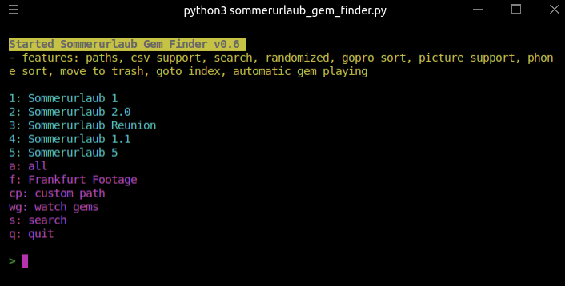
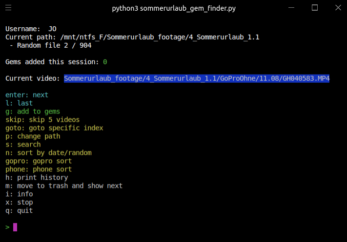

<!-- PROJECT LOGO -->
<br />
<p align="center">

  <h3 align="center">Sommerurlaub Gem Finder</h3>

  <p align="center">
    Sommerurlaub Gem Finder simplifies searching video footage for highlights and writes data about hightlights in csv
    <br />
    <br />
    <a href="https://github.com/Djamal-Sadaghiani/evergreen/issues">Report Bug</a>
    ·
    <a href="https://github.com/Djamal-Sadaghiani/evergreen/issues">Request Feature</a>
  </p>
</p>

## About the project

Hilft beim suchen indem es random videos spielt und wenn man ein highlight findet automatisch die excel ausfüllt

Immer wenn man enter drückt kriegst du ein random video aus dem ausgewählten sommerurlaub (oder allen) und wenn du "g" eigibst soll er die aktuelle zeit, den timestamp im video, deinen namen automatisch auslesen, dann gibst du einen kommentar zb "mathias passout" dazu ein und er speichert es in eine excel. dann guckst du weiter oder drückst wieder enter für das nächste video solange du bock hast und am ende kannst du den schneide boys einfach deine excel schicken

Also nimmt einem die unnötige arbeit ab selber alles einzutragen und man kann watch zeit maximieren




## Requirements

- Python3
- vlc
- linux?

## Getting started

1. Clone the repository
   ```sh
   git clone https://github.com/oboth3co/sommerurlaub_gem_finder.git
   ```
2. Install requirements
3. Fill "paths.txt" with your paths according to the order:
   - Sommerurlaub 1
   - Sommerurlaub 2.0
   - Sommerurlaub reunion
   - Sommerurlaub 1.1
   - Sommerurlaub 5
   - Frankfurt footage
   - Sommerurlaub (überordner)
   - trash folder

<!-- CONTRIBUTING -->

## Contributing

1. Create your Feature Branch (`git checkout -b feature/AmazingFeature`)
2. Commit your Changes (`git commit -m 'Added some AmazingFeature'`)
3. Push to the Branch (`git push origin feature/AmazingFeature`)
4. Open a Pull Request

## Contact

Jan Oboth - jd.oboth@gmail.com

<!-- LICENSE -->

## License

TBD

<!-- MARKDOWN LINKS & IMAGES -->
<!-- https://www.markdownguide.org/basic-syntax/#reference-style-links -->
